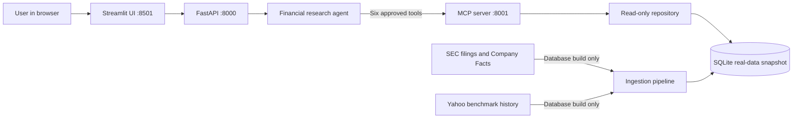

# Automatisor Financial Research Agent

This project is a local financial research assistant. You choose an analyst persona and a sector, ask a question, and receive an answer grounded in the included SQLite database.

The agent does not search the internet while answering questions. It reads financial data only through the MCP server, and every result includes source links, the data date, confidence, and any important limitations.

## Run the project

### 1. Install the requirements

You need:

- Python 3.12
- [uv](https://docs.astral.sh/uv/)
- An OpenAI API key

Open a terminal in the project folder and run:

```powershell
uv sync
```

This installs all required Python packages.

### 2. Create the environment file

Copy the example file:

```powershell
Copy-Item .env.example .env
```

Open `.env` and add your OpenAI API key:

```dotenv
OPENAI_API_KEY=your_openai_api_key_here
```

That is the only value you must provide to use the included database. The other settings already contain working local defaults.

`SEC_USER_AGENT` is needed only if you choose to rebuild the database from SEC filings. It is not needed for normal testing.

### 3. Start the three services

Open three terminals in the project folder. Keep all three running.

Terminal 1 — start the MCP server:

```powershell
uv run automatisor-mcp
```

Terminal 2 — start the API:

```powershell
uv run automatisor-api
```

Terminal 3 — start the user interface:

```powershell
uv run streamlit run streamlit_app.py --server.address 127.0.0.1
```

Open [http://127.0.0.1:8501](http://127.0.0.1:8501) in your browser.

## Questions you can try

Choose the matching persona and sector in the left sidebar before asking a question.

| Persona | Sector | Example question |
|---|---|---|
| Equity analyst | Tech | What is the most recent headcount or hiring signal available for Box? |
| Mutual fund analyst | Tech | Is this sector a good place to be putting money to work right now? |
| Mutual fund analyst | Retail | Which companies look like long-term core holdings and which should I avoid? |
| Equity analyst | Retail | Which retailers have the strongest and weakest margin profiles? |
| PE analyst | Logistics | Which companies look like attractive buyout targets based on the available data? |
| Mutual fund analyst | Logistics | Rank the covered companies for a long-term portfolio. |

The covered companies are:

- Tech: Box, Dropbox, Teradata, and Rapid7
- Retail: Abercrombie & Fitch, Urban Outfitters, Dick's Sporting Goods, and Best Buy
- Logistics: GXO Logistics, Hub Group, ArcBest, and C.H. Robinson

## About the included database

The repository already includes `data/financial_agent.db`. The reviewer does not need to build or download data before using the application.

This database is a point-in-time snapshot built from real source data:

- SEC Company Facts for reported financial metrics
- SEC 10-K and 10-Q filings for headcount, hiring, strategy, operations, and risks
- Yahoo Finance price history for the IGV, XRT, and IYT sector benchmarks

It currently contains 12 companies, 380 financial metric rows, 55 operating signals, 148 qualitative evidence records, and 64 source records. It contains no synthetic fixture sources.

When a user asks a question, the agent and MCP server read this local database. They do not fetch new information from the internet. This keeps answers reproducible and prevents the model from filling gaps with unverified web information.

The data is real but not permanently current. Every answer therefore shows its data date and limitations. For example, headcount is often reported annually and may be older than the latest quarterly financial results.

### Optional: rebuild the database with newer data

This step is not required for normal review. To rebuild the database, first set a real SEC contact value in `.env`:

```dotenv
SEC_USER_AGENT=Your Name your.email@example.com
```

Then run:

```powershell
uv run automatisor-build-db --mode live --cache-dir data/cache --output data/financial_agent.db
```

The cache stores downloaded SEC and market responses so an interrupted or repeated build does not download the same files again.

## Database schema design

The SQLite database uses six linked tables. Financial facts, operating signals, qualitative evidence, and benchmarks all point to a source record. Runtime access is read-only.

[Read the database schema design](docs/schema_design.md)

## MCP design

MCP is the safety boundary between the AI agent and the database. The agent cannot run arbitrary SQL and cannot write to the database. It can use only six predefined, validated tools.

[Read the MCP design](docs/mcp_design.md)

## MCP tools and capabilities

| Tool | What it does |
|---|---|
| `list_sector_companies` | Lists the companies covered in a selected sector and their latest available data dates. |
| `resolve_company` | Converts a company name or ticker into a safe internal company ID within the selected sector. |
| `get_company_snapshot` | Returns financial history, derived metrics, headcount, operating signals, qualitative evidence, coverage, and sources for one company. |
| `compare_company_metrics` | Compares approved metrics across up to five covered companies and five reporting periods. |
| `get_sector_benchmark` | Returns the sector ETF return, peer operating-margin median, dispersion, dates, and sources. |
| `search_company_evidence` | Searches only the qualitative evidence already stored in the database. |

All tools are sector-scoped, read-only, parameterized, and bounded. Missing companies or metrics return safe error codes instead of raw database errors.

## One improvement with more time

I would add richer sector-specific operating KPIs. The current database has a strong common financial foundation, but measures such as SaaS retention for software, comparable-store sales for retail, and shipment or yield metrics for logistics would make company comparisons more precise.

## Architecture

At question time, the path is always: **User → Streamlit → API → Agent → MCP → SQLite**. Internet sources are used only by the optional database build command.


