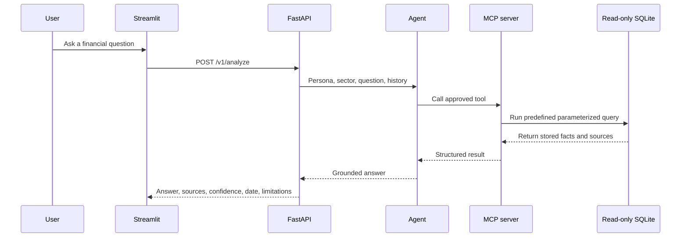

# MCP Design

The Model Context Protocol (MCP) server is the controlled data layer between the financial research agent and SQLite.

The key rule is simple: **the agent cannot access the database directly**. It must use one of six approved MCP tools.

## Request flow



## Available tools

### `list_sector_companies(sector)`

Lists the covered companies in `tech`, `retail`, or `logistics`. It also returns the latest available financial and operating dates.

### `resolve_company(sector, query)`

Matches a company name or ticker inside the selected sector and returns its stable internal ID. If the company is not covered, it returns `company_not_found` and the valid companies for that sector.

### `get_company_snapshot(sector, company_id, periods=5)`

Returns one company's financial history, calculated metrics, operating signals, qualitative evidence, coverage information, and source records.

### `compare_company_metrics(sector, company_ids, metrics, periods=5)`

Compares approved metrics across covered companies. An empty company list means all companies in the sector. Requests are limited to five companies, ten metrics, and five periods.

### `get_sector_benchmark(sector)`

Returns the sector ETF price return, peer operating-margin median and range, observation dates, sources, and warnings.

### `search_company_evidence(sector, query, company_ids=[], topics=[], limit=10)`

Searches only filing evidence already stored in SQLite. It does not search the web. Results can be filtered by company and topic and are capped at ten records.

## Standard tool response

Every tool returns the same outer structure:

```json
{
  "ok": true,
  "data": {},
  "sources": [],
  "as_of": "YYYY-MM-DD",
  "coverage": {},
  "warnings": []
}
```

This makes tool results predictable for the agent and easy to inspect during review.

## Safety controls

- The MCP server is read-only and exposes no write or schema-changing tool.
- There is no arbitrary `query_database` or SQL-generation tool.
- Every request is restricted to the selected sector.
- Company IDs are resolved before company-specific data is requested.
- Metrics come from a fixed allowlist.
- Result sizes are bounded.
- SQL is predefined and parameterized.
- Errors use safe codes: `invalid_sector`, `company_not_found`, `invalid_metric`, `insufficient_data`, and `dependency_failed`.
- Raw SQL errors and internal database details are never returned to the model.

## Grounding checks

After the model produces an answer, the application checks that:

- At least one MCP tool was used for an analytical question.
- Every tool call used the selected sector.
- Every referenced company and source appeared in the current MCP results.
- Displayed numeric facts match values returned by MCP.
- Missing information is stated as a limitation instead of being estimated.

If these checks fail repeatedly, the API returns a safe insufficient-data response rather than an unsupported conclusion.

## Internet boundary

The MCP server never fetches live internet data while answering a question. SEC and Yahoo data are fetched only by the separate optional database-build command. Normal queries read the bundled `data/financial_agent.db` snapshot.
