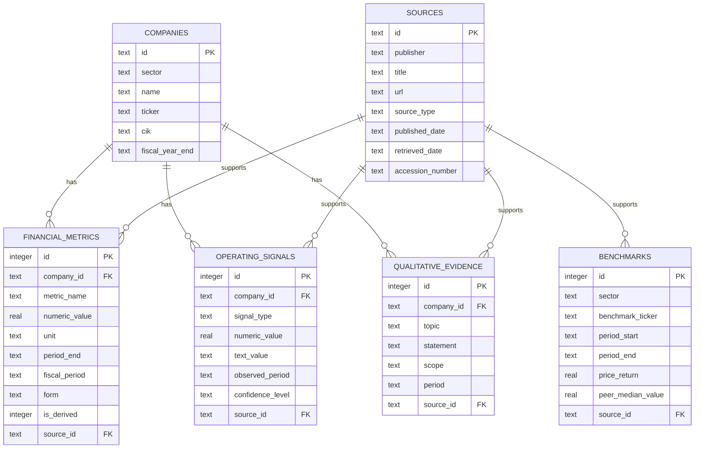

# Database Schema Design

The project uses SQLite because the dataset is small, local, easy to review, and does not need a separate database service. The application opens the database in read-only and query-only mode while answering questions.

The SQL source of truth is [`src/automatisor/db/schema.sql`](../src/automatisor/db/schema.sql).

## Schema overview

## The six tables

| Table | Purpose |
|---|---|
| `companies` | Stores the fixed company universe, sector, ticker, SEC CIK, and fiscal year end. |
| `financial_metrics` | Stores reported and calculated numeric metrics by company and reporting period. |
| `operating_signals` | Stores numeric or text signals such as headcount, hiring, restructuring, and automation. |
| `qualitative_evidence` | Stores short filing statements about strategy, growth, risks, competition, labor, and operations. |
| `benchmarks` | Stores sector ETF returns and peer operating-margin context. |
| `sources` | Stores provenance: publisher, title, URL, dates, source type, and SEC accession number. |

## Important relationships

- Every company fact belongs to one company through `company_id`.
- Every fact, signal, evidence record, and benchmark points to a source through `source_id`.
- Foreign keys prevent records from referring to companies or sources that do not exist.
- A unique constraint prevents the same company metric and reporting period from being loaded twice.

## Financial metrics

Reported metrics include revenue, gross profit, operating income, net income, operating cash flow, capital expenditure, cash, debt, shares, and market capitalization.

The ingestion pipeline also calculates supported values with fixed formulas:

- Revenue growth
- Gross margin
- Operating margin
- Free cash flow
- Free-cash-flow margin
- Net debt
- Enterprise value
- Enterprise-value-to-revenue, when the required inputs and provenance are available

Calculated rows are marked with `is_derived=1`, so they remain distinguishable from directly reported values.

## Safety and performance

- Runtime connections use SQLite read-only mode and `PRAGMA query_only=ON`.
- SQL statements are predefined and parameterized.
- Indexes support sector, company, metric, period, topic, and source lookups.
- Comparison requests are capped by company, metric, and period count.
- Missing values stay missing; the database builder does not invent replacements.

## Data-quality notes

SEC tags and fiscal calendars vary by company. Headcount is commonly annual, while financial results may be quarterly. Market and benchmark data are point-in-time observations. These differences are kept visible through periods, source links, confidence, and limitations.
